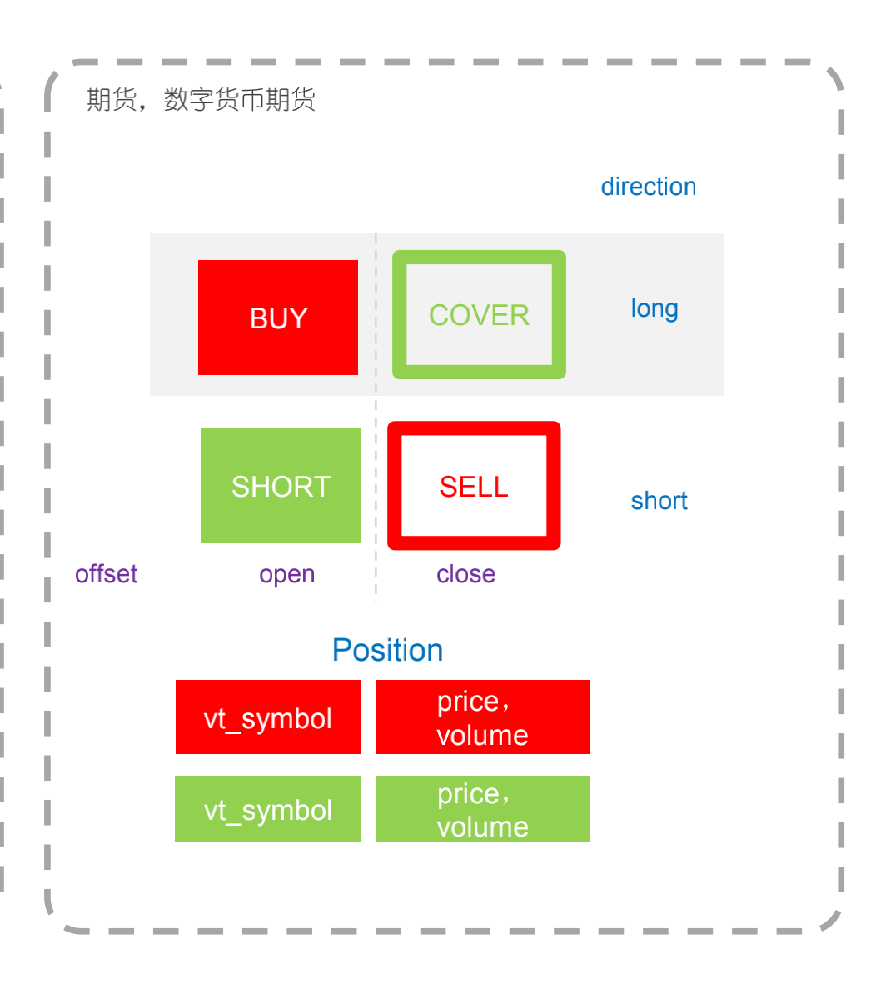
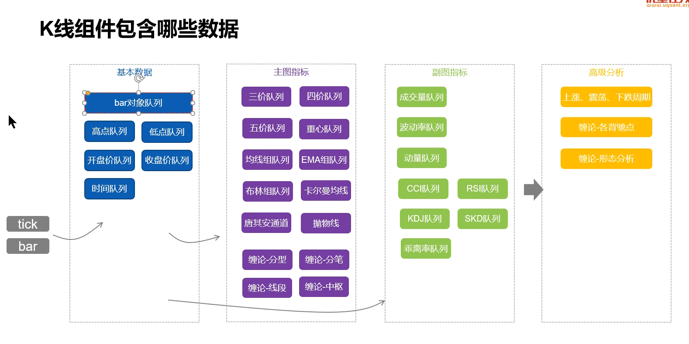

2022 3，4，5，6, 7
## 策略发出的动作，
### 一般有四个：
- 买入开多 = buy
- 卖出平多 = sell
- 卖出开空 = short
- 买入平空 = cover
### 动作前置依赖
- 开，open，代表开仓动作，依赖帐号的可用资金
- 平，close，代表平仓动作，依赖帐号的持仓

### 策略组合

## 长周期趋势策略（v1_6版本) • 2小时及以上
- 主攻大波段
- 开仓信号趋势跟随
- 及时反手应对趋势陷阱
## 短周期趋势策略(v1版本) • 2小时以下
- 注重短期趋势突破或反转

### k线

